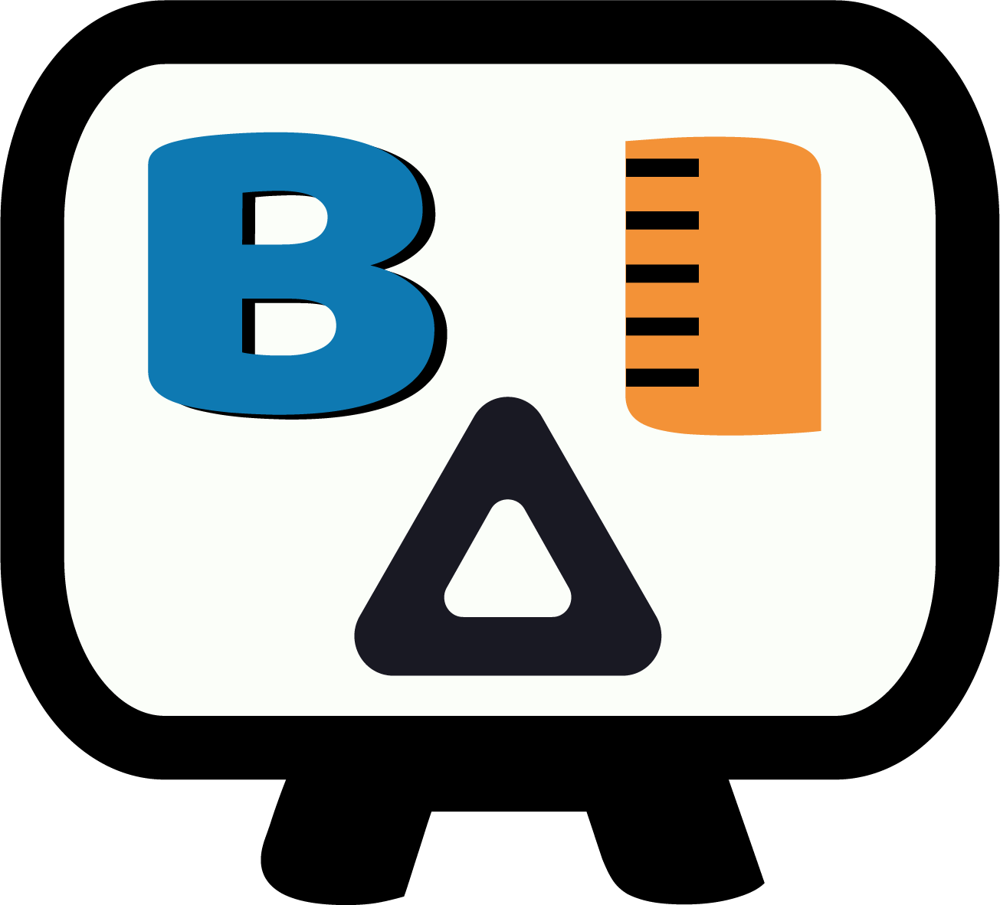
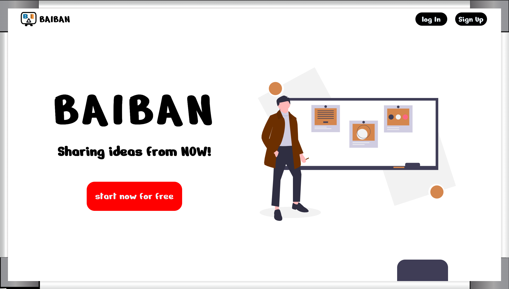
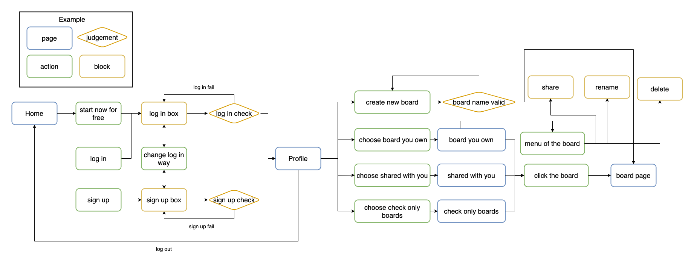
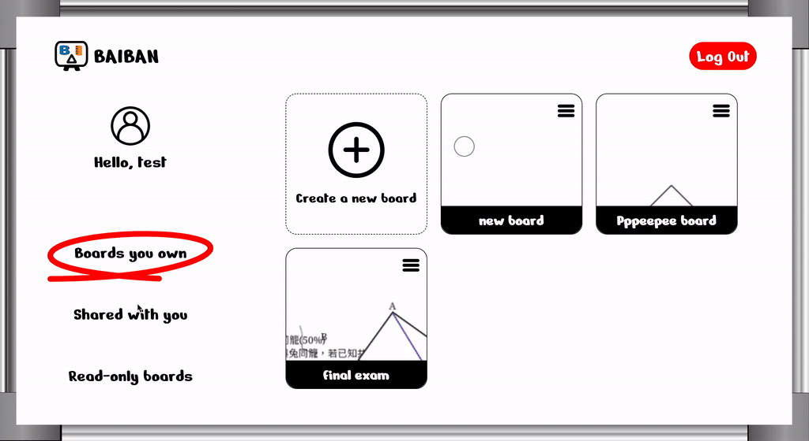

#   BAIBAN

Responding to the booming remote education needs in the post-epidemic era, BAIBAN provides an interactive classroom in which users can demonstrate, cooperate, and discuss with each other simultaneously.

## Website Link

Link: <https://biben-1193b.web.app/> \
Use Facebook or Google account to login.\
You can also create your own native account or use default test account below.\
**User: test@gmail.com**\
**PassWord: 111111**

## Techniques

* Front-End Web Design
    + HTML / CSS / JavaScript
    + SCSS
    + RWD
* Frameworks
    + React (Hook)
    + React Router
* JavsScript Library
    + Fabric.js
    + Fabric-history
* Firebase
    + Firestore
    + Hosting
    + Authentication
* Other
    + Version Control : Git / GitHub
    + Lint : ESLint

## User Flow

## Website Demo
Home page and log in

Profile page and boards type separation

Board page and functions

## Plan for Next Version

* RWD design of the board page. 
* Allow users to clone the board and edit the authority of shared boards.
* Improve UI of the board page.
* Refactor of the code.

## Contact
If you got any problem when using BAIBAN, or had any suggestion about it. Please feel free to contact with me via email.\
E-mail: <dragonlonss@gmail.com>
